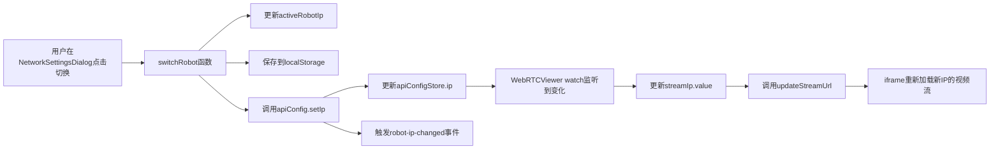
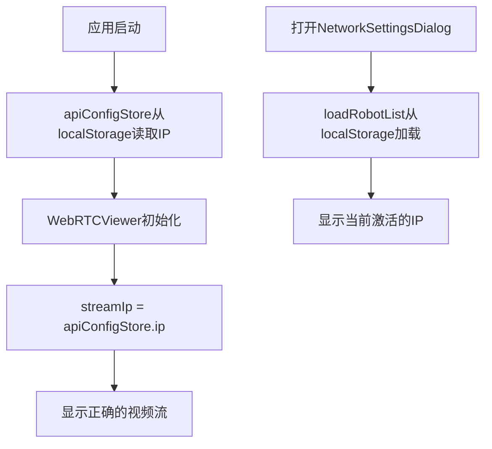

# WebRTC IP配置统一实现

## 需求
WebRTCViewer.vue 需要使用 NetworkSettingsDialog.vue 中设置的IP地址。

## 实现方案

### 1. API配置Store增强
**文件**: `xiaobei-frontend/src/stores/apiConfig.ts`

在store的返回值中导出`ip`字段,使其可被其他组件访问:

```typescript
return {
  ip,  // 新增 - 导出IP字段
  port,
  port2,
  apiBaseUrl,
  apiExtUrl,
  apiUrl,
  apiUrl2,
  networkLatency,
  lastCheckTime,
  isChecking,
  latencyStatusText,
  latencyStatusColor,
  setIp,
  checkNetworkLatency,
  saveConfig
}
```

### 2. WebRTCViewer使用apiConfigStore的IP
**文件**: `xiaobei-frontend/src/views/WebRTCViewer.vue`

#### 修改前:
```typescript
const streamIp = ref<string>('192.168.11.55')
```

#### 修改后:
```typescript
// 视频流配置 - 使用 apiConfigStore 中的 IP
const streamIp = ref<string>(apiConfigStore.ip)
```

#### 移除IP的localStorage保存:
```typescript
// 保存配置到 localStorage（不保存IP，IP从 apiConfigStore 获取）
function saveConfig() {
  localStorage.setItem('webrtc_port', String(streamPort.value))
  // ... 其他配置
}
```

#### 监听IP变化:
```typescript
// 监听 apiConfigStore 的 IP 变化
watch(() => apiConfigStore.ip, (newIp) => {
  streamIp.value = newIp
  updateStreamUrl()
  console.log(`WebRTC IP 已更新为: ${newIp}`)
})
```

### 3. NetworkSettingsDialog配置管理
**文件**: `xiaobei-frontend/src/components/monitor/dialogs/settings/NetworkSettingsDialog.vue`

当前使用localStorage存储配置(标记为TODO,将来迁移到后端API):

```typescript
// TODO: 迁移到后端API持久化
function saveToLocalStorage() {
  localStorage.setItem('robot_list', JSON.stringify(robotList.value))
}

// 切换机器人时同步到apiConfigStore
function switchRobot(robot: RobotConfig) {
  activeRobotIp.value = robot.ip
  localStorage.setItem('active_robot_ip', robot.ip)
  
  // 更新API配置store - 关键步骤!
  apiConfig.setIp(robot.ip)
  
  // 触发全局事件
  window.dispatchEvent(new CustomEvent('robot-ip-changed', {
    detail: { ip: robot.ip }
  }))
  
  // 检查网络延迟
  setTimeout(() => {
    apiConfig.checkNetworkLatency()
  }, 1000)
  
  confirmSuccess(`已切换到: ${robot.description} (${robot.ip})`)
}
```

## 数据流

### IP切换流程


### 初始化流程


## 关键特性

1. **单一数据源**: 所有组件通过`apiConfigStore.ip`获取IP
2. **响应式更新**: 使用Vue的watch机制自动响应IP变化
3. **向后兼容**: 保留localStorage作为临时存储
4. **实时同步**: IP切换后,WebRTCViewer自动更新视频流地址

## 测试步骤

1. 打开应用,进入监控页面
2. 点击底部"网络设置"按钮
3. 在列表中选择一个不同的IP并点击"切换"
4. 观察顶部横幅显示的"当前激活"IP已更新
5. 打开WebRTC Viewer页面
6. 验证视频流地址是否使用了新选择的IP
7. 再次切换IP,验证WebRTC Viewer自动更新

## 后续优化(TODO)

1. **后端API持久化**: 
   - 创建`/api/v1/robot-config`接口
   - 将robot_list和active_ip存储在后端JSON文件
   - NetworkSettingsDialog改为调用后端API

2. **多设备同步**: 
   - 后端持久化后,多个前端实例可以共享同一配置
   - 适合团队协作场景

3. **密码加密**: 
   - 当前密码明文存储在localStorage
   - 生产环境需要加密存储

## 注意事项

- WebRTCViewer的其他配置(port, stream_name等)仍保存在localStorage
- 只有IP地址通过apiConfigStore统一管理
- NetworkSettingsDialog中标记了TODO,提示未来需要迁移到后端API

